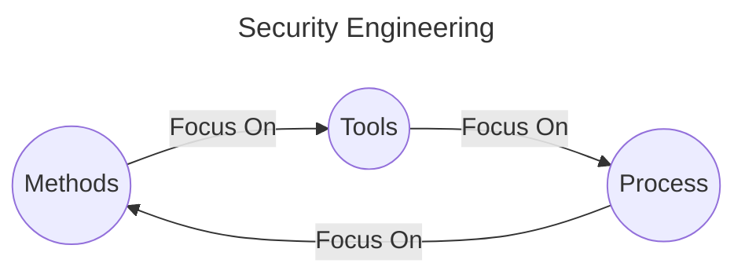
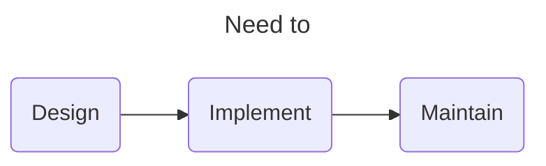
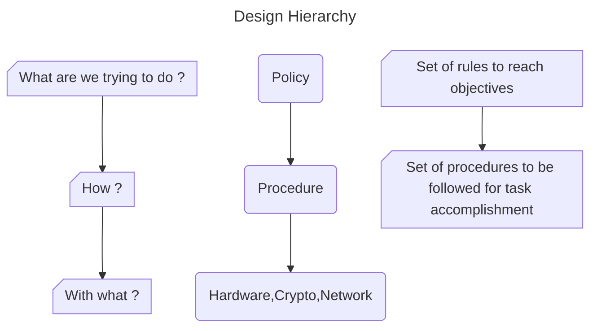
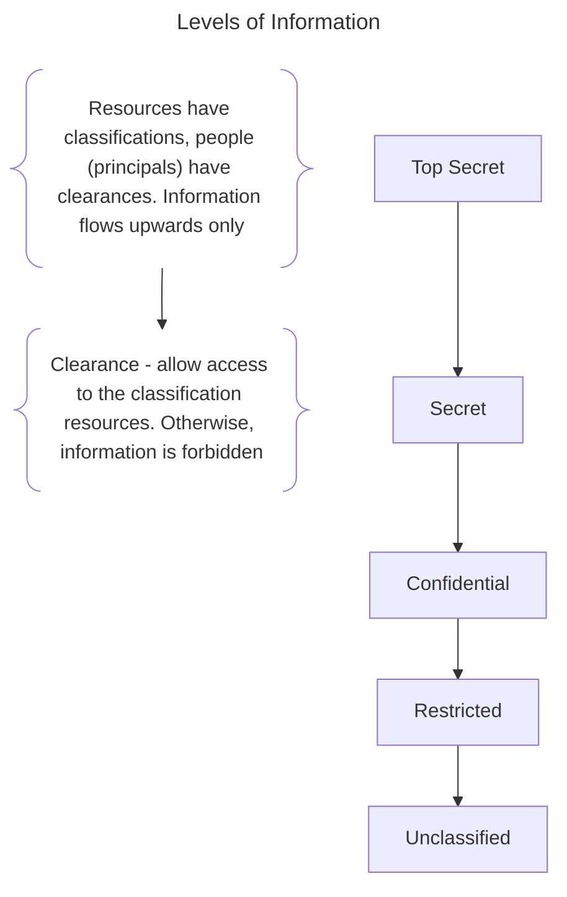

# Chapter 1 Introduction

## Index
* [Chapter 1 Introduction](#chapter-1-introduction)
  * [Index](#index)
  * [1.1 Security Engineering](#11-security-engineering)
  * [1.2 Security vs Dependability](#12-security-vs-dependability)
  * [1.3 Design Hierarchy](#13-design-hierarchy)
  * [1.4 Framework](#14-framework)
    * [Policy](#policy)
    * [Mechanism](#mechanism)
    * [Assurance](#assurance)
    * [Incentive/Motivation](#incentivemotivation)
      * [Terms](#terms)
  * [1.5 Levels of Information](#15-levels-of-information)
    * [Description](#description)
  * [1.6 Corporate Security System](#16-corporate-security-system)
    * [Core Elements](#core-elements)
  * [1.7 Three Pillars of Security](#17-three-pillars-of-security)
    * [Terms](#terms-1)

## 1.1 Security Engineering

[Back To Top](#Index)

## 1.2 Security vs Dependability

1. Dependability = Security + Reliability
2. Reliability and security are often correlated in practice

[Back To Top](#Index)

## 1.3 Design Hierarchy

[Back To Top](#Index)

## 1.4 Framework
1. [Policy](#policy)
2. [Mechanism](#mechanism)
3. [Assurance](#assurance)
4. [Incentive/Motivation](#incentivemotivation)

### Policy
- What you are supposed to achieve
### Mechanism
- Tools you assemble in order to implement the policy
### Assurance
- The amount of reliance you can place on each particular mechanism
### Incentive/Motivation
1. The motive that the people guarding and maintaining the system to do their job properly
2. The motive that the attackers have to try to defeat your policy

#### Terms
1. System
   - product or component 
   - OS, Communications and other things that go to make up an organization's infrastructure
   - IT staff
2. Subject
   - physical person in any role  
3. Person
   - either a physical person or a legal person such as a company or government
4. Principal
   - an entity that participates in a security system. 
5. Trusted
   - system or component is one whose failure can break the security policy
6. Trustworthy
   - System or component is one that won't fail
7. Secrecy
   - technical term which refers to the effect of the mechanism used to limit the number of principals who can access information, such as cryptography or computer access controls.
8. Confidentiality
   - involves the obligation to protect some person's or organization's secrets if you know them. 
9.  Privacy
    - ability or right to protect your personal information and extends to the ability or right to prevent attacks of your personal space. 

[Back To Top](#Index)

## 1.5 Levels of Information

### Description
1. Top Secret
   - Compromise could cost many lives or do exceptionally grave damage to operations
   - E.g. intelligence sources and methods
2. Secret
   - Compromise could threaten lives directly
   - E.g. weapon system performance 
3. Confidential
   - compromise could damage to operations
4. Restricted
   - compromise could lead to criminal charges or cause irreparable damage to company

[Back To Top](#Index)

## 1.6 Corporate Security System
### Core Elements
1. Personal Security
2. Physical Security
3. Information Security
4. Corporate Security
5. Compliance and ethics programs
6. Crime prevention and detection
7. Fraud prevention
8. Investigations
9. Risk management
10. Business continuity planning
11. Crisis management
12. Environment, safety, and health

[Back To Top](#Index)

## 1.7 Three Pillars of Security
1. People
   - Everyone in the business needs to be aware of their role in preventing and reducing cyber threats, whether it's handling sensitive data, understanding how to spot phishing emails, or the use of BYOD. 
2. Processes
   - Defining how the organization's activities, roles and documentation are used to mitigate the risks to the organization's information.
3. Technology
   - Technology can be deployed to prevent or reduce the impact of cyber risks, depending on the risks assessment and what you deem an acceptable level of risk.

### Terms
1. BYOD
   - Bring Your Own Device
   - E.g. smartphones, tablets, and laptops

[Back To Top](#Index)

[NEXT](C2.md)
[Back To README](README.md)