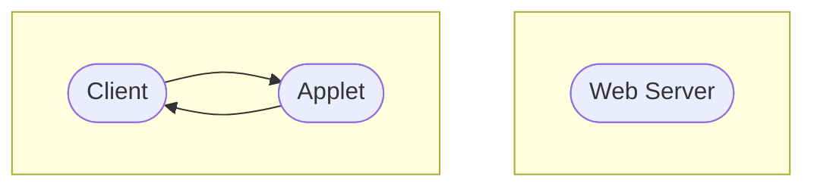

# Chapter 2 Components of Corporate Security

## Index
* [Chapter 2 Components of Corporate Security](#chapter-2-components-of-corporate-security)
  * [Index](#index)
  * [2.1 Protocol](#21-protocol)
  * [2.2 Passwords](#22-passwords)
    * [Key VS Password](#key-vs-password)
    * [Attacks on Passwords](#attacks-on-passwords)
    * [Other Password Issues](#other-password-issues)
    * [Password Vault VS Single Sign-On](#password-vault-vs-single-sign-on)
  * [2.3 Cryptography](#23-cryptography)
    * [Cryptography Role in an enterprise](#cryptography-role-in-an-enterprise)
    * [Three states of data](#three-states-of-data)
    * [Implementing Cryptography (In enterprise)](#implementing-cryptography-in-enterprise)
  * [2.4 Access Control](#24-access-control)
    * [Types of Access Control](#types-of-access-control)
    * [Authentication VS Authorization](#authentication-vs-authorization)
    * [Lampson's Access Control Matrix](#lampsons-access-control-matrix)
    * [Capabilities](#capabilities)
      * [Acls VS Capabilities](#acls-vs-capabilities)
  * [2.5 Distributed Systems](#25-distributed-systems)
    * [Web Applets](#web-applets)
    * [Software and Hardware Service Layers](#software-and-hardware-service-layers)
    * [Two-tier and Three-tier Architectures](#two-tier-and-three-tier-architectures)
    * [Distributed Systems Security](#distributed-systems-security)
  * [2.6 Corporate Security Policy Model](#26-corporate-security-policy-model)
    * [The Transformation Process](#the-transformation-process)
      * [Security Policy](#security-policy)
      * [Security Model](#security-model)

## 2.1 Protocol
1. series of steps that principals use to establish trust relationships in a system
2. a typical security system consists of several principals (e.g., people, companies, computers and magnetic card readers etc.)
3. which communicate using a variety of channels and by carrying data on physical devices.

[Back To Top](#index)

## 2.2 Passwords
1. provide the first line of defense against unauthorized access to your computer and personal information.
2. **Cost**: Passwords are free
3. **Convenience**: Easier for system admin to reset password than to issue user a new thumb

### Key VS Password
| Key | Password |
| --- | --- |
| Space key is 64 bits | Password is 8 characters, and 256 different characters |
| Then the key space is 2^64 | Then the key space is 256^8 = 2^64 |
| Choose key at random | Users do not select passwords at random |
| Then attacker must try 2^63 keys | Attacker has far less than 2^63 pwds to try (dictionary attack) |

[Back To Top](#index)

### Attacks on Passwords
1. Attacker could
   1. Target one particular account
   2. Target any account on system
   3. Target any account on any system
   4. Attempt denial of service (DOS) attack
2. Common attack path (All these may only require **one** weak password!)
   1. Outsider
   2. Normal user
   3. Administrator

### Other Password Issues
1. Social Engineering
2. Failure to change default passwords
3. Error logs contain "almost" passwords
4. Bugs, keystroke logging, spyware, etc.

### Password Vault VS Single Sign-On
1. Password vault
   - called a password manager
   - stores all your credentials for multiple programs in a secure location and in an encrypted format.
   - Users can access the password vault with a single master password. 
2. Single sign-on
   - secure solution that provides employees access to company apps and websites by asking them to sign in just once a day, using one username and password.

[Back To Top](#index)

## 2.3 Cryptography
1. Cyptography: science and art of designing ciphers
2. Cyptanalysis: science and art of breaking them
3. Cryptology: study of both

### Cryptography Role in an enterprise
1. Encryption is a key element of comprehensive data-centric security; another security control;addtional prevention layer.
2. Minimize the risks of stolen data
3. Before or while deploying encryption, implement the following controls or processes:
   1. Reduce attack surface for applications, systems and networks
   2. Implement strong application access controls
   3. Implement log management and monitoring solutions to detect anomalous activity across the network, on systems and in/around databases
   4. Separate data access from data management; business users of sensitive data should access it through applications with strong granular user access controls
   5. Ensure reasonable and appropriate physical security for network storage, and system components
   6. Implement strong authentication and authorization controls between applications and the databases they access
   7. Follow best practices for securing databases and the servers that house or manage them

### Three states of data
1. Data at rest
   - Data that is stored on a desktops, laptops, mobile phones, tablets, and lot devices.
2. Data in motion
   - Data being transmitted over a network.
3. Data in use
   - in the process of being generated, updated, erased, or viewed.

### Implementing Cryptography (In enterprise)
1. In House Solution
2. Outsource
   - purchase a system, install it in your data center, and assign in-house staff to manage it.

3. Tokenization
   - replaces sensitive data with non-sensitive substitutes without altering the type or length of the data.

[Back To Top](#index)

## 2.4 Access Control
- granting or denying approval to use specific resources; it is controlling access
1. Physical access control
   - fencing hardware door locks, and mantraps that limit contact with devices.
2. Technical access control
   - technology restrictions that limit users on computers from accessing data.

### Types of Access Control
1. Discretionary Access Control (DAC)
   - Authorizations based on (user or group) permissions. Zero knowledge of object sensitivity.
2. Mandatory Access Control (MAC)
   - Authorizations based on (user or group) permissions and object labels.
3. Role-Based Access Control (RBAC)
   - Authorizations based on group permissions. User is part of a group.

### Authentication VS Authorization
1. Authentication
   - Restrictions on who (or what) can access system.
2. Authorization
   - Restrictions actions of authenticated users

### Lampson's Access Control Matrix
1. Subjects (users)
   - index of rows
2. Objects (resources)
   - index of columns

### Capabilities
1. Store access control matrix by row

#### Acls VS Capabilities
1. Note that arrows point in opposite directions
2. still need to associate users to files

[Back To Top](#index)

## 2.5 Distributed Systems
| Distributed | Early | Internet-scale | Contemporary |
| --- | --- | --- | --- |
| Scale | Small | Large | Ultra-large |
| Heterogeneity | Limited (typically relatively homogenous configurations) | Significant in terms of platforms, languages and middleware | Added dimensions introduced including radically different styles of architecture
| Openness | Not a priority | Significant priority with range of standards introduced | Major research challenge with existing standards not yet able to embrace complex systems
| Quanlity of Service | In its infancy | Significant priority with range of services introduced | Major research challenge with existing standards not yet able to embrace complex systems

### Web Applets
1. client request results in the downloading of applet code

2. client interacts with applet

### Software and Hardware Service Layers

### Two-tier and Three-tier Architectures

### Distributed Systems Security
1. Interception
   - Access by unauthorized users 
2. Interruption
   - Service or data becomes unavailable 
3. Modification
   - Unauthorized tampering of data or services
4. Fabrication
   - Additional data or info is fabricated

[Back To Top](#index)

## 2.6 Corporate Security Policy Model
### The Transformation Process

1. Security Policy
   - abstract objectives, goals and requirements
   - Rules or practice
   - Framework
2. Security Model
   - Mathematical relationship and formulas
   - Specifications
   - Data structure
3. Programming
   - Computer code
   - GUI - check box

#### Security Policy
- Outlines the security requirements of an organization
- abstract term that represents the objectives and goals a system must meet and accomplish to be deemed secure and acceptable.
- set of rules and practices that dictates how sensitive information and resources are managed, protected, and distributed.
- expresses what the security level should be by setting the goals of what the security mechanisms are supposed to accomplish.
- Provides the framework for the systems security architecture.

#### Security Model
- Outlines the requirements needed to support the security policy and how authorization is enforced.
- Maps the abstract goals of the policy to the information system terms by specifying explicit data structures and techniques that are necessary to enforce the security policy.
- Maps the desires of the policymakers into a set of rules that computer system must follow.

[Back To Top](#index)

[NEXT](C3.md)
[Back To README](README.md)