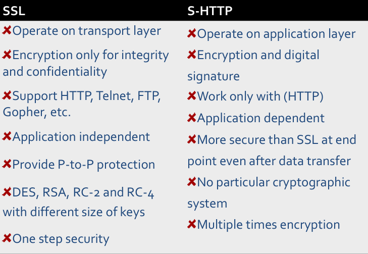
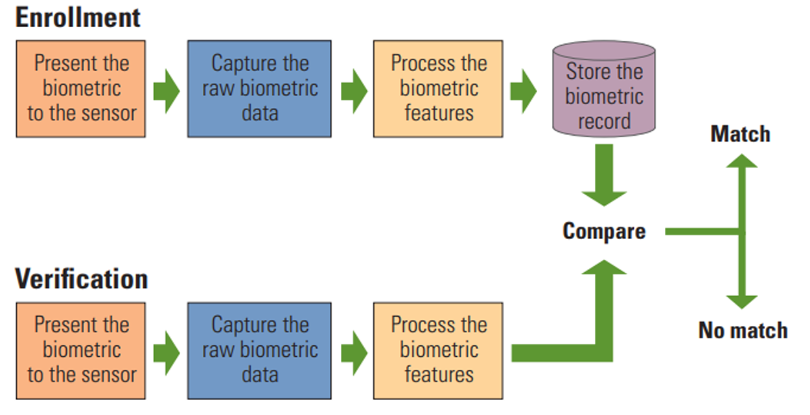
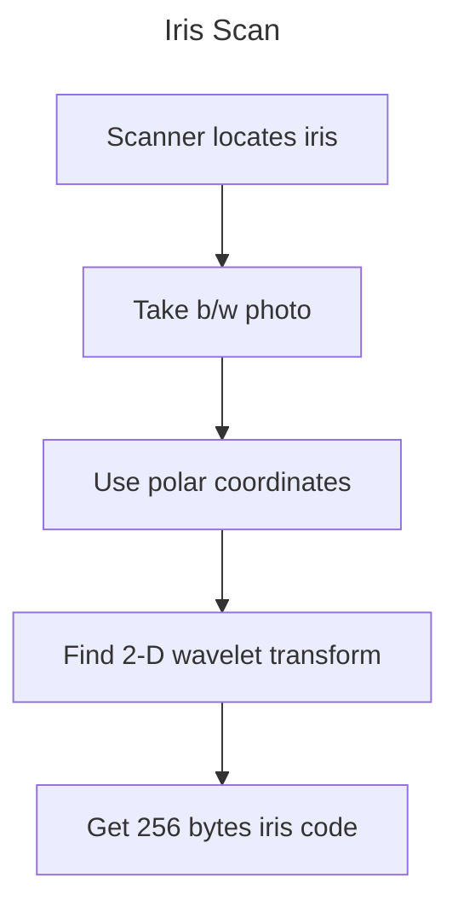
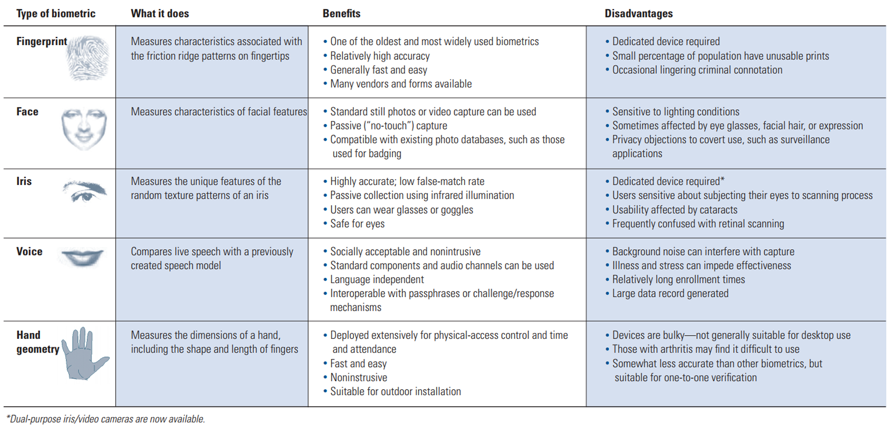

# Chapter 3 Approaches and Mechanisms for Corporate Security

## Index 
* [Chapter 3 Approaches and Mechanisms for Corporate Security](#chapter-3-approaches-and-mechanisms-for-corporate-security)
  * [Index](#index)
  * [3.1 Payment System](#31-payment-system)
    * [Challenges](#challenges)
    * [Solutions](#solutions)
    * [Secure Protocols](#secure-protocols)
      * [SSL](#ssl)
      * [S-HTTP (Secured HTTP)](#s-http-secured-http)
      * [Secure Electronic Transaction (SET)](#secure-electronic-transaction-set)
      * [Digital Signature](#digital-signature)
  * [3.2 Monitoring System](#32-monitoring-system)
    * [Network Monitoring](#network-monitoring)
    * [Techniques](#techniques)
      * [Passive Network Monitoring Tools](#passive-network-monitoring-tools)
  * [3.3 Biometric System](#33-biometric-system)
    * [Reasons for Biometrics](#reasons-for-biometrics)
    * [Ideal Biometric System](#ideal-biometric-system)
    * [Biometric modes](#biometric-modes)
    * [Enrollment VS Recognition](#enrollment-vs-recognition)
    * [Biometric Errors](#biometric-errors)
  * [3.4 Latest Approaches](#34-latest-approaches)
    * [Hand Geometry](#hand-geometry)
      * [Advantages](#advantages)
      * [Disadvantages](#disadvantages)
    * [Iris Patterns](#iris-patterns)
      * [Iris Scan](#iris-scan)
    * [Biometric comparision](#biometric-comparision)

## 3.1 Payment System

### Challenges
1. Trusting other electronically
2. Security threats
3. Network connectivity and availability issues
4. Global economy issues

### Solutions
1. Certify public keys in a "trusted" fashion
   - Certificate Authorities (CA)
2. Secure protocols between entities
3. Digital signatures trusted records and non-repudiation
4. Distribute key pairs to all interested entities

### Secure Protocols
1. Secure Socket Layer (SSL)
2. IP Security (IPSec)
3. SMTP Security (S/MIME) -> Email
4. Secure Electronic Transaction (SET) -> Credit Card

#### SSL

1. Operates between the application layer and the transport layer
2. Negotiates and employs essential functions for secure transactions

#### S-HTTP (Secured HTTP)

#### Secure Electronic Transaction (SET)
1. Developed by Visa and MasterCard
2. Specifications
    - Digital certificates
    - Public Key (privacy)

#### Digital Signature
- an electronic, encrypted stamp of authenticity on digital data.

[Back To Top](#index)

## 3.2 Monitoring System

### Network Monitoring
1. allows the administrator to know the health status of the network
2. provides information about collected data and the analysis of such raw data with a view to identify threatened or limited resources, effectively.
3. Uses network probe. Probes let you isolate traffic problems and congestion slowing your network to a crawl.

### Techniques
1. Active Monitoring
   - relies upon data gathered from probe packets injected into the network
2. Passive Monitoring
   - relies upon data gathered from actual network traffic

#### Passive Network Monitoring Tools
1. Multi Router Traffic Grapher (MRTG)
   - is a tool for monitoring traffic load on network links. MRTG generates HTML pages that provide a live visual representation of this traffic.
2. Limitation
   - It cannot provide information that shows which host or application may be causing a traffic bottleneck.

[Back To Top](#index)

## 3.3 Biometric System
- "you are your key" - Schneier

### Reasons for Biometrics
1. Cheap and reliable biometrics needed
2. a very active area of research
3. Biometrics are used in security today

### Ideal Biometric System
1. Universal - applies to everyone
2. Distinguishing - distinguish with certainty
3. Permanent - physical characteristics being measured never changes
4. Collectable - easy to collect required data
5. Safe, easy to use

### Biometric modes
1. Identification
2. Authentication

### Enrollment VS Recognition
1. Enrollment phase
   - Subject's biometric info put into database
   - Must carefully measure the required information
   - OK if slow and repeated measurement needed
   - Must be very precise for good recognition
   - A weak point of many biometric schemes
2. Recognition phase
   - Biometric detection when used in practice
   - Must be quick and simple
   - But must be reasonably accurate

### Biometric Errors
1. Fraud rate VS insult rate
   - Fraud - user A mis-authenticated as user B
   - Insult - user A not authenticated as user A 
2. For any biometric, can decrease fraud or insult, but other will increase
3. Equal error rate: rate where fraud and insult are equal

[Back To Top](#index)

## 3.4 Latest Approaches
### Hand Geometry
1. popular form of boimetric
2. measures the shape of the hand
3. Hand geometry sufficient for many situations
4. Suitable for authentication
5. Not useful for ID problems

#### Advantages
1. Quick
2. 1 minute to enroll
3. 5 seconds to recognize
4. Hand symmetric (use other hand backwards)

#### Disadvantages
1. Cannot use on very young or very old
2. Relatively high equal error rate

### Iris Patterns
1. Iris patterns development is "chaoitic"
2. Little or no genetic influence
3. Different even for identical twins
4. Pattern is stable through life

#### Iris Scan

### Biometric comparision

[NEXT](C5.md)
[Back To README](README.md)