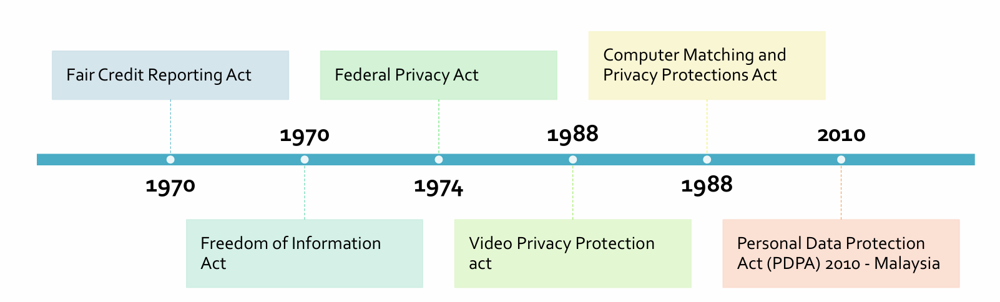

# Chapter 4 Security Policy of Eletornic Business

## Index
* [Chapter 4 Security Policy of Eletornic Business](#chapter-4-security-policy-of-eletornic-business)
  * [Index](#index)
  * [4.1 Copyright](#41-copyright)
    * [Information](#information)
    * [What is protected?](#what-is-protected)
    * [What is not protected?](#what-is-not-protected)
    * [Rights of Copyright Owner](#rights-of-copyright-owner)
    * [Copyright Notice](#copyright-notice)
    * [When can you use copyrighted material?](#when-can-you-use-copyrighted-material)
  * [4.2 Fair Use](#42-fair-use)
    * [What Should I do ?](#what-should-i-do-)
    * [Fair Use ...](#fair-use-)
    * [Fair Use Factors](#fair-use-factors)
      * [Purpose and Character of Use](#purpose-and-character-of-use)
      * [Nature of the Copyrighted Work](#nature-of-the-copyrighted-work)
      * [Amount and Substantiality of the Portion Used](#amount-and-substantiality-of-the-portion-used)
  * [4.3 Information Hiding](#43-information-hiding)
    * [Table 4.1 Information Hiding Techniques](#table-41-information-hiding-techniques)
    * [Steganography](#steganography)
    * [Network Protocols and Procedures](#network-protocols-and-procedures)
    * [Watermarking VS Steganography](#watermarking-vs-steganography)
    * [Watermark Attacks](#watermark-attacks)
  * [4.4 Privacy Mechanisms](#44-privacy-mechanisms)
    * [How did get they my data?](#how-did-get-they-my-data)
    * [Privacy Legislation](#privacy-legislation)
    * [Monitoring Software](#monitoring-software)
      * [Monitoring by Web Sites](#monitoring-by-web-sites)
    * [Anonymous Web Browsing](#anonymous-web-browsing)
    * [Web-Based User Tracking](#web-based-user-tracking)

## 4.1 Copyright
Gives authors or artists the legal right to exclude others from using their works.
1. Legal Right
2. granted to an author, composer, playwright, publisher or distributor
3. to exclusive publication, production, sale, or distribution
4. of a literary, musical, dramatic, or artistic work
5. protects "original works of authorship" that are fixed in "a tangible form of expression."

### Information
1. no formal registration system for copyrights in Malaysia as there are granted automatically.
2. under the Copyright Act 1987, the owner can prepare a Statutory Declaration as a supporting document or file a Voluntary Notification and deposit his/her copyrighted work with the Intellectual Property Corporation of Malaysia (MyIPO).
3. work is considered fixed when is stored on some medium in which it can be perceived, reproduced, or communicated.
4. rights begin at the moment of "fixation".

### What is protected?
1. Literary works (all text including computer software)
2. musical works
3. dramatic works
4. pantomimes and choreographic works
5. pictorial, graphic, and sculptural works
6. motion pictures and other audiovisual works
7. sound recordings
8. architectural works

### What is not protected?
1. Ideas, concepts, discoveries
2. titles, names, short phrases, slogans
3. works that are not fixed in a tangible form of expression such as improvised speech or dance
4. works consisting entirely of information that is commonly available and contains no originality
5. anything written or created by the US Government

### Rights of Copyright Owner
1. make copies of the work
2. distribute copies of the work
3. perform the work publicly (such as for plays, film, dances or music)
4. display the work publicly (such as for artwork, or any material used on the internet or television)
5. make "derivative works"

def: **Derivative Works** - including making modifications, adaptations or other new uses of a work, or translating the work to another media.

### Copyright Notice
1. © symbol or the word "Copyright"
2. Sound recordings use the ℗ symbol (the letter P in a circle)
3. Example: © 2019 John Doe

### When can you use copyrighted material?
1. Personal, academic, not-for-profit use - some authors will let you use.
2. Give the author credit 
   - Linking to author's site
3. This falls under "Fair Use".

## 4.2 Fair Use
1. Policy in the US copyright law allows
2. limited use of copyrighted material 
3. without requiring permission from the rights holders
4. such as commentary, criticism, news reporting, research, teaching or scholarship.

### What Should I do ?
1. Everything on Web is copyrighted property of someone 
2. Academic use does NOT automatically protect you from being sued for copyright infringement
3. Example [guidelines](https://marymount.libguides.com/c.php?g=271976&p=1815238) for copyright in academic

### Fair Use ...
1. Still an unsettled area of law
2. a balancing test, not a black and whitelist of rules
3. Not a meeting one of the four criteria does not eliminate you from using this exception
4. Not withstanding the provisions of sections 106 and 106A, the fair use of a copyrighted work, including such use by reproduction in copies or phonorecords or by any other means specified by that section, for purposes such as criticism, comment, news reporting, teaching (including multiple copies for classroom use), scholarship, or research, is not an infringement of copyright.

### Fair Use Factors
1. Purpose and character of the use
   - commercial or non-profit educational purposes
2. Nature of the copyrighted work
   - factual or creative
3. Amount and substantiality of the portion used
   - how much of the work is used
4. Effect of the use upon the potential market or value of the copyrighted work
   - does the use affect the market for the original work

#### Purpose and Character of Use
1. Profit-making does not automatically eliminate you if you are providing some sore of public service.
2. If your creation is a "new" product, a parody, for example, it may fall within fair use.

#### Nature of the Copyrighted Work
1. The less "creative" the material is, the more likely this favors fair use.
   - Data and facts cannot be copyrighted (presentation/format can be copyrighted, however)
2. The more "creative" the material is, the more copyright comes into play.
3. Probably the least important factors.

#### Amount and Substantiality of the Portion Used
1. The more you copy of work, the less likely it will fall into "fair use".
2. Quantitative and qualitative factors come into play.
3. If one percent of a book comprises the "heart" of the material, copying that one percent is the same as copying the entire work (example: 300 - 400 words copied from President Ford's unpublished memoirs).
4. It really depends ...
5. On the context of the copy, and 
6. The nature of the material 
   1. which brings us to the most important factor of all

## 4.3 Information Hiding
1. Cryptography
2. Steganography
3. Digital Watermarking

### Table 4.1 Information Hiding Techniques
| Cryptography | Steganography | Digital Watermarking |
|--------------|---------------|----------------------|
| art and science of secret writing | art and science of hiding information | process of embedding message on a host signal |
| is unreadable, understandable, opaque and data is scrambled | is imperceptible, data is hidden, and isn't scrambled | is invisible or perceptual visible, depending on the requirement |
| make the message unreadable to anyone who doesn't have the key and know the correct algorithm. | Hide the existence of the message | marking media files with copyright information and avoid illegal copying |
| No one would be able to know what the message says unless there's a key to the code | The hidden message is imperceptible to anyone | An unauthorized person cannot detect, retrieve, or modify the embedded watermark |

### Steganography
1. Threats
   1. Theft of intellectual property
      - IP is the formulas, prototypes, copyrights, and customer lists maintained by a company, can be far more valuable than the actual items they sell.
   2. Corporate espionage
      - Espionage - the use of spies to collect information about what another entity is doing or planning.

### Network Protocols and Procedures
1. Wherever possible within the network environment, disable users’ ability to install software application without prior authorization.
2. Wherever possible, disable the users’ ability to connect external devices such as thumb drives, personal data assistants and MP3 players, to a network machine.
3. Restrict users from saving information directly to one computer or hard disk drive. Require that all data be stored on user specific directories housed within the network or file server.
4. Monitor network traffic for high volumes of graphics, audio and image files that may be used as carriers
5. Monitor network traffic for large segments of unintelligible data streams, such as what may be seen if encrypted data were being transmitted.
6. Create a baseline hash of all of the images stored on the corporate web site. Periodically rehash the images to ensure that they have not been altered or used as carriers for hidden messages.
7. Establish a means to recompile all graphic, audio and video files using a lossy compression scheme, such as JPEG or MPEG compression. 
8. Develop methods for randomly sampling and testing information transmitted and stored throughout the network

### Watermarking VS Steganography
1. Watermarking
   - The hidden information itself is not important by itself (no secure), it says something about the covertext.
   - ususally needs lower data capacity
   - Applications:
     - Authenticity: Proof of ownership
     - Fingerprinting: privacy tracking
     - Integrity: tamper detection
     - Data augmentation: add metadata
2. Steganography
   - The covertext has no value, it is only there to convey the stegotext. Stegotext is the valuable information and is independent of the covertext.
   - Applications:
     - Stealthy communication of messages

### Watermark Attacks
1. Robustness Attacks
   - remove or diminish the presence of the watermark
2. Presentation Attacks
   - modify the content so that detector can not find the hidden watermark
3. Interpretation Attacks
   - prevent assertion of ownership, e.g., rewatermarking

[Back to Top](#index)

## 4.4 Privacy Mechanisms
1. Where is my data?
2. How is it used?
3. Who sees it?
4. Is anything private anymore?

### How did get they my data?
1. Loans 
2. Charge Accounts
3. Order via Mail
4. Magazine Subscriptions
5. Tax Forms
6. Applications for Schools, Jobs, Clubs
7. Insurance Claims
8. Hospital Stay
9. Sending Checks
10. Fund-Raisers
11. Advertisers
12. Warranties
13. Military Draft Registration
14. Court Petition

### Privacy Legislation

### Monitoring Software
1. Screen Capture
2. Email Capture
3. Keystroke Capture
4. Length of breaks
5. What computer files are used and for how long

#### Monitoring by Web Sites
1. City
2. Site you just left
3. Everything you do while on this site
4. Hardware and software you use
5. Click stream 
   - Series of clicks that link from site to site
   - History of what the user chooses to view 
6. Cookie
   - Stores information about you
   - Located on your hard drive
7. Beneficial uses
   - Viewing preferences
   - Online shopping
   - Secure sites retain password in cookie
8. Controversial uses
   - Tracking surfing habits for advertisers
9.  Can set browser to refuse cookies or warn before storing
10. Software available to manage cookies

### Anonymous Web Browsing
- Why ?
    - Discuss health issues or financial matters anonymously
    - Bypass Internet censorship in parts of the world
    - Conceal interaction with gambling sites
    - Law enforcement
- Two goals
    - Hide user identity from target web site
    - Hide browsing pattern from employer or ISP 
- Stronger goal: mutual anonymity
    - made up of three parts
        - anonymous initiator
        - anonymous responder
        - anonymous communication between these two entities

### Web-Based User Tracking
1. 3rd party cookies; Flash cookies
2. Tracking through the history file
3. Machine fingerprinting

[Back to Top](#index)

[NEXT](C5.md)
[Back To README](README.md)