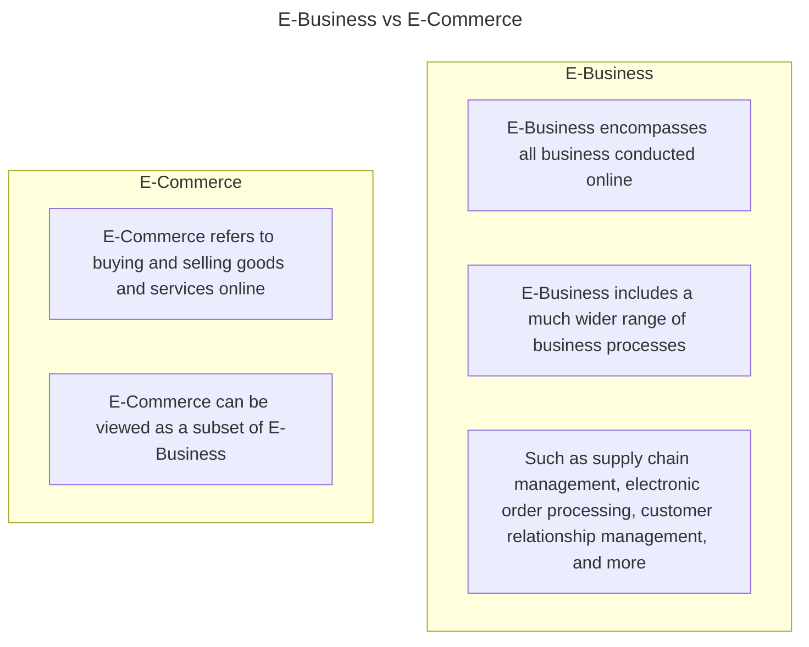
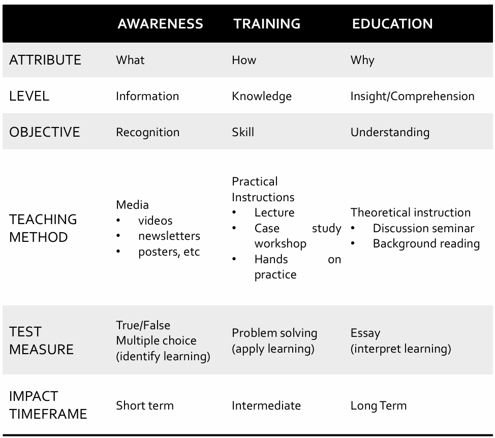

# Chapter 5 Security Policy of Eletornic Business

## Index
* [Chapter 5 Security Policy of Eletornic Business](#chapter-5-security-policy-of-eletornic-business)
  * [Index](#index)
  * [5.1 E-Business](#51-e-business)
  * [5.2 Security Awareness, Training, and Education](#52-security-awareness-training-and-education)
    * [Awareness](#awareness)
    * [Training](#training)
    * [Education](#education)
  * [5.3 Organizational Security Policy](#53-organizational-security-policy)
    * [Four important roles](#four-important-roles)
    * [Security Policy Topics](#security-policy-topics)
    * [Employment Practices and Policies](#employment-practices-and-policies)
      * [Threats from internal users include:](#threats-from-internal-users-include)
    * [Hiring Practices and Procedures](#hiring-practices-and-procedures)
      * [Backgroud Check and Screening](#backgroud-check-and-screening)
      * [Employment Agreements](#employment-agreements)
      * [During Employment](#during-employment)
        * [Least Privilege](#least-privilege)
        * [Monitoring of Special Privileges](#monitoring-of-special-privileges)
      * [Work practices](#work-practices)
        * [Separation of Duties](#separation-of-duties)
        * [Job Rotation](#job-rotation)
        * [Personnel/Staffing Security](#personnelstaffing-security)
    * [Termination of Employement](#termination-of-employement)
      * [Termination](#termination)
  * [5.4 Ethical Issue](#54-ethical-issue)
  * [5.5 Codes of Conduct](#55-codes-of-conduct)
    * [Four principles of codes of conduct (Nokia)](#four-principles-of-codes-of-conduct-nokia)
    * [Codes of conduct (Sony)](#codes-of-conduct-sony)
    * [Benefits Codes of Conduct](#benefits-codes-of-conduct)

## 5.1 E-Business 
1. refers to the use of the Web, Internet, intranets, extranets, or some combination thereof to conduct business

[Back To Top](#index)

## 5.2 Security Awareness, Training, and Education
Benefits to organizations:
1. Improving employee behavior
2. Increasing the ability to hold employees accountable for their actions
3. Mitigating liability of the organization for an employee's behavior
4. Complying with regulations and contractual obligations

### Awareness
1. A program seeks to inform and focus and employees attention on issues realated to seucrity within the orgranization

### Training
1. A security training program is designed to teach people the skills to perform there is related tasks more securely -> focus on practical specific tasks/software

### Education
1. It more properly fits into the category of employee career development programs.
2. Targeted at security professionals and those whose jobs require expertise in security.
3. Broader process, develop critical thinking skills

[Back To Top](#index)

## 5.3 Organizational Security Policy
1. A security policy is a formal statement of the rules by which people who are given access to an organization's technology and information assets must abide.

### Four important roles
1. It makes clear what is being protected and why.
2. It articulates, in general terms, the security procedures, controls, and standards used in the organization.
3. It clearly states the responsibility for that protection.
4. It provides a basis on which to interpret and resolve any later conflicts that may arise.

### Security Policy Topics
1. Principles
2. Organizational reporting structure
3. Physical security
4. Hiring management, and firing
5. Data protection
6. Communication and security
7. Hardware
8. Software
9. Operating system
10. Technical support
11. Privacy
12. Access
13. Accountability
14. Authentication
15. Availability
16. Maintenance
17. Violations reporting
18. Business continuity
19. Supporting information

### Employment Practices and Policies
#### Threats from internal users include:
1. Gaining unauthorized access or enabling others to gain unauthorized access
2. Altering data
3. Deleting production and backup data
4. Crashing systems
5. Destroying data
6. Misusing systems for personal gain or to damage the organization
7. Holding data hostage
8. Stealing strategic or customer for corporate espionage or fraud schemes

### Hiring Practices and Procedures
1. Effective assessment of qualifications
2. Background verification
3. Non-disclosure agreements
4. Intellectual property agreements
5. Employment agreements
6. Agreement to abide by all organizational policies
7. Formal job descriptions

#### Backgroud Check and Screening
1. Ask for much detail as possible about employment and educational history
2. Investigate the accuracy of the details to the extent reasonable
3. Arrange for experienced staff members to interview candidates and discuss discrepancies
4. Have an investigation agency do a background check
5. Get a criminal record check of the individual
6. Check the applicant's credit record for evidence of large personal debt
7. Consider conducting a polygraph examination
8. Ask the applicant to obtain bonding for his or her position

#### Employment Agreements
1. Employee should agree and sign the terms and conditions of employment contract
2. The agreement should include a confidentiality and nondisclosure agreement spelling out specifically that the orgranization's information assets
3. The agreement should reference the organization's security policy and indicate that the employee has reviewed and agrees to abide by the policy

#### During Employment
1. Least privilege
   - Minimum access necessary or according to related job scopes
2. Separation of duties
   - People involved in checking for inappropriate use are not also capable of making such inappropriate use
   - Having all the security functions and audit responsibilities reside in the same person is dangerous.
3. Limited reliance on key employees
   - No one in an orgranization should be irreplaceable
   - Organizations should have written policies and plans established for unexpected illness or departure.

##### Least Privilege
1. Users should have the fewest or lowest number of privileges required to accomplish their duties
2. Individual personnel should have access to only the information that they require in order to perform their stated duties
3. Independent of security clearance

##### Monitoring of Special Privileges
1. Privileged users have more power
2. Mistakes have greater impact
3. Record activities
   1. Network administrators
   2. System administrators
   3. Database administrators
   4. Application administrators

#### Work practices
1. Separation of duties
   - Designing sentive processes so that two or more persons are required to complete them
2. Job rotation
   - Good for cross-training, and also reduces the likelihood that employees will collude for personal gain
3. Mandatory vacations
   - Detect / prevent irregularities that violate policy and practices

##### Separation of Duties
1. High-value or high-risk tasks require two or more different individuals to complete

##### Job Rotation
1. More individual workers through a range of job assignments
2. Reduces monotony, risk
3. Reduces likelihood htat employees will perform inappropriate or illegal actions if they fear being caught when next job rotation occurs

##### Personnel/Staffing Security
1. Periodic performance
2. Disciplinary action policy and procedures
3. Termination procedures

### Termination of Employement
1. Removing the persion;s name form all lists of authorized access
2. Explicitly informing guards that the ex-employee is not allowed into the building without special authorization by named employees
3. Removing all personal access codes
4. If appropriate, changing lock combinations, reprogramming access card systems, and replacing physical locks
5. Recovering all assets, including employee ID, disks, docuements, and equipment.

#### Termination
1. Immediate termination of all logical and physical access
2. Change passwords known to the employee
3. Recovery of all assets
4. Notification of the termination to affected staff, customers, other third parties
5. And possibly: code review of recent activities prior to the termination

[Back to Top](#index)

## 5.4 Ethical Issue
- arise as the result of the roles of computers:
  1. Repositories and processors of information
  2. Producers of new forms and types of assets
  3. Instruments of acts
  4. Symbols of intimidation (threat) and deception (fraud)

[Back to Top](#index)

## 5.5 Codes of Conduct
- provide guidance to professionals and to articulate what employers and customers have a right to expect.

### Four principles of codes of conduct (Nokia)
1. follow the laws of the countries
2. personnaly set the example of each other and our stakeholders by being honest and fair.
3. We promote a culture of integrity
4. We hold each other accountable

### Codes of conduct (Sony)
1. Core Principles
2. Fair Labor and Employment Practices
3. Responsibility for Product and Services
4. Protection of Intellectual Assets
5. Fair Business Practices
6. Responsible Business Conduct
7. Ethical Personal Conduct
8. Responsibility of Every One of Us

### Benefits Codes of Conduct
1. As a positive stimulus for ethical conduct, and to instill confidence in the customer or user of an IS product or service.
2. A code can be educational
3. A code provides a measeure of support for a professional whose decision to act ethically in a situation may create conflict with an employer or customer.
4. A code can be a means of deterrence and discipline.
5. A code can enhance the profession's public image, if it is seen to be widely honored.

[Back to Top](#index)

[NEXT](C5.md)
[Back To README](README.md)